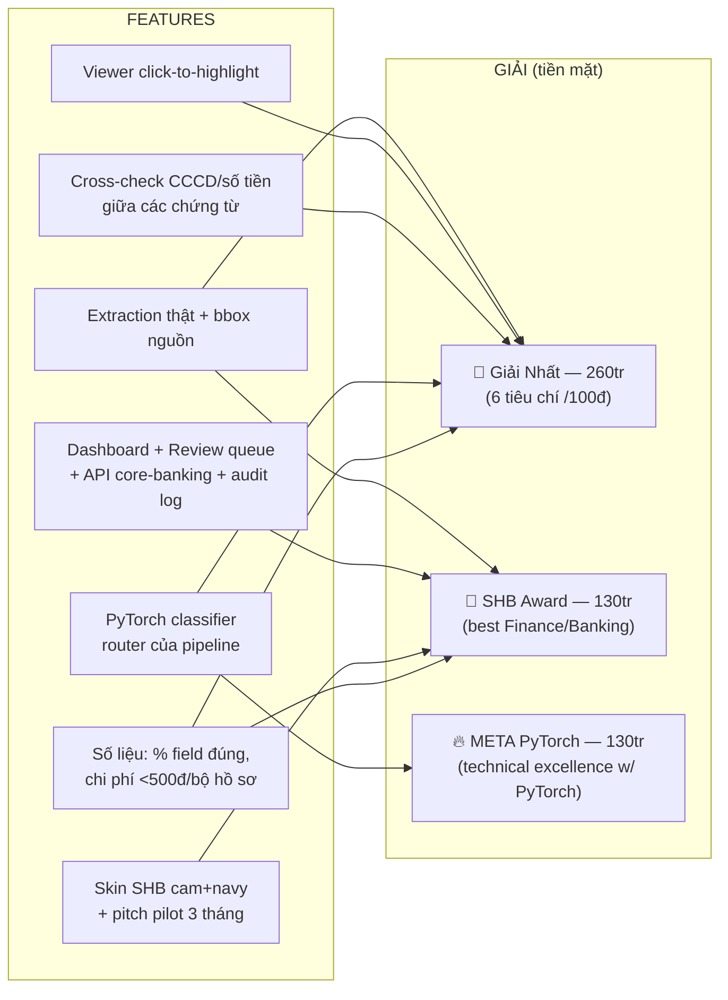
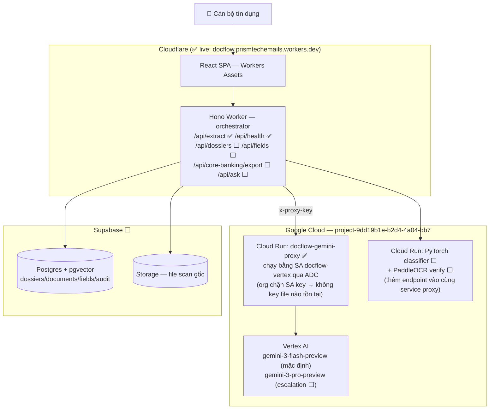
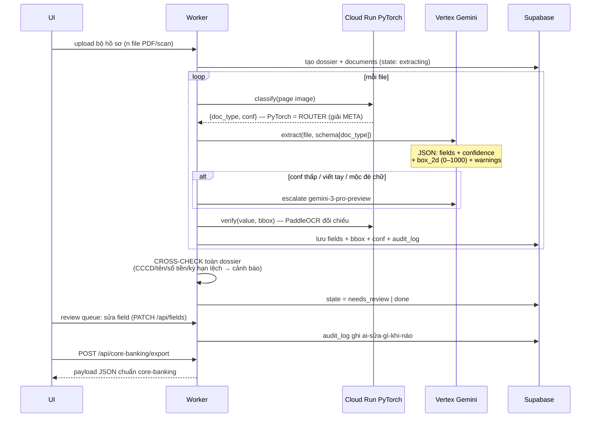
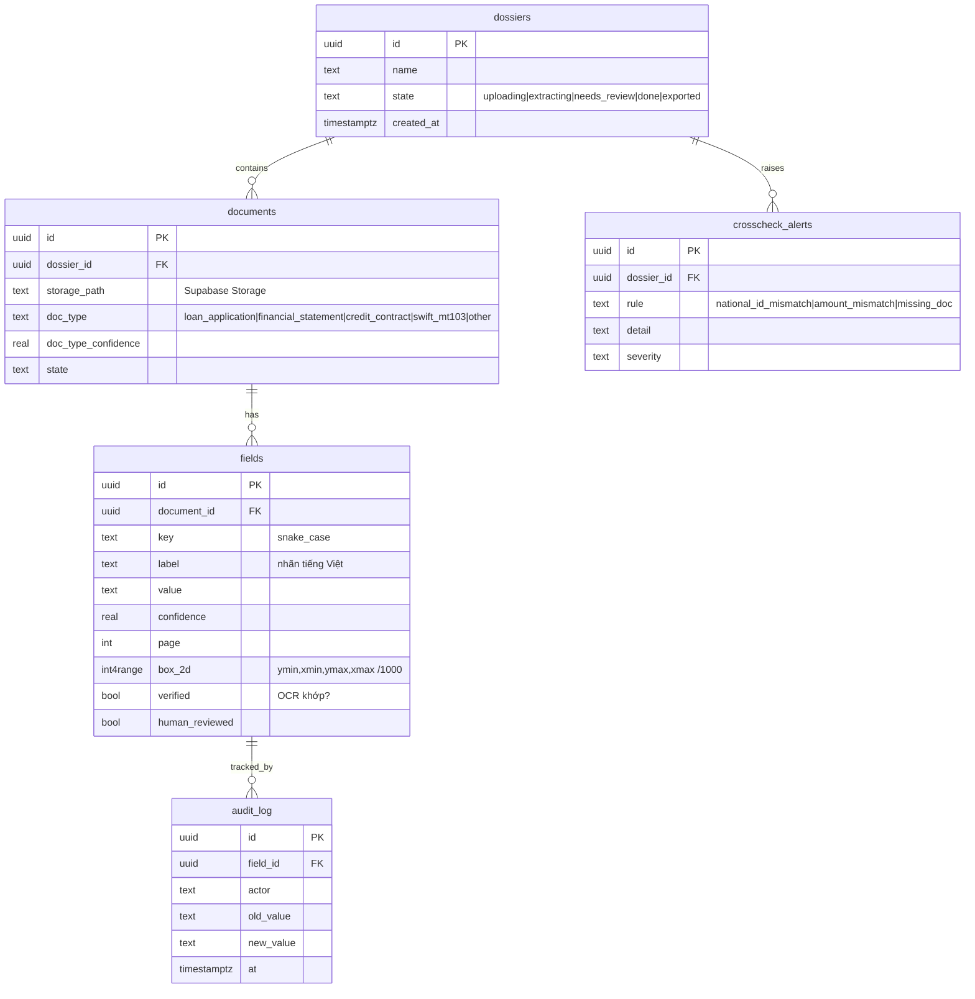
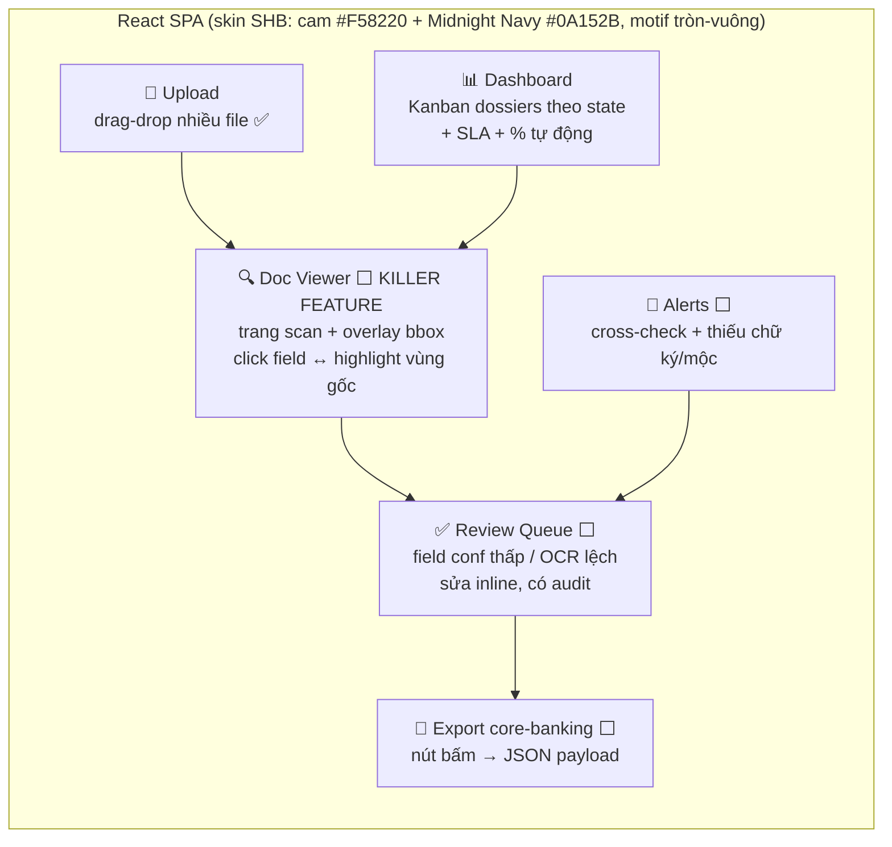

# DocFlow — Kiến trúc, Pipeline & Bản đồ tiền thưởng

> Đọc file này đầu mỗi phiên. Mọi dòng code phải trả lời được câu hỏi: **"nó phục vụ giải nào?"**
> Deadline: CP1 ~~18/07 11:00~~ (nộp sớm) · CP2 18/07 23:00 (live URL + repo) · Final 19/07 11:00 · Demo Day 19/07 chiều.

## 1. Bản đồ tiền — feature nào ăn giải nào (tổng đích: 520 triệu VND)



**6 tiêu chí chấm /100đ:** Technical · AI-Native Architecture · Business Viability & Pilot Pathway · AI-Native UX · AI Safety/Grounding & Trust · Presentation.
**3 vòng:** AI pre-screen (tất cả) → Human review (top 30–40) → Demo Day (top 10, pitch 4' + Q&A 2').

## 2. Kiến trúc hệ thống (đã deploy phần ✅)



**Vì sao Cloud Run proxy thay vì gọi thẳng:** ① org policy chặn tạo SA key; ② ví prepay Gemini API = 0đ (chỉ Vertex đi qua billing postpaid); ③ Google chặn IP Cloudflare với free-tier key ("user location not supported"). ADC + proxy né cả 3 — và là điểm cộng khi pitch: "không có credential file nào tồn tại trong hệ thống".

## 3. Pipeline xử lý một bộ hồ sơ



**Nguyên tắc chống ảo giác (tiêu chí Grounding):** field nào không đọc được → bỏ/warning, KHÔNG đoán. Mọi value phải có `box_2d` trỏ về bản gốc. Verify OCR lệch → đẩy vào review queue, không tự tin mồm.

## 4. Data model (Supabase)



## 5. UI — cấu trúc & vũ đạo demo 4 phút



**Kịch bản demo (đã test chạy thật):** ① kéo 4 file hồ sơ scan xấu vào → ② 30s ra bảng field + badge GEMINI → ③ click "Số CCCD" → viewer nhảy đúng vùng trên hợp đồng → ④ alert đỏ "CCCD lệch giữa đơn vay (...345) và hợp đồng (...346)" + "thiếu chữ ký/con dấu" (Gemini tự bắt được — đã verify) → ⑤ sửa 1 field trong review queue → ⑥ bấm Export core-banking → ⑦ slide chi phí: <500đ/bộ hồ sơ.

## 6. Env / secrets / lệnh

| Nơi | Key | Trạng thái |
|---|---|---|
| CF var (wrangler.jsonc) | `GEMINI_PROXY_URL` | ✅ |
| CF secret | `GEMINI_PROXY_KEY` | ✅ |
| CF secret (chưa dùng) | `GEMINI_API_KEY` (free-tier luatviet — bị chặn IP CF, giữ làm fallback local dev) | ✅ |
| Cloud Run env | `PROXY_KEY`, `GCP_LOCATION=global` | ✅ |
| CF secret | `SUPABASE_URL`, `SUPABASE_SECRET_KEY` | ⬜ |

```bash
# build + deploy web (Node 22: source ~/.nvm/nvm.sh && nvm use 22)
pnpm build && npx wrangler deploy
# deploy proxy (từ gcp-proxy/, build local vì Cloud Build bị siết IAM)
docker build --platform linux/amd64 -t asia-southeast1-docker.pkg.dev/project-9dd19b1e-b2d4-4a04-bb7/docflow/gemini-proxy:vN . \
  && docker push ... && gcloud run deploy docflow-gemini-proxy --image ...
```

## 7. Luật bất di bất dịch

1. **AI-LOG.md cập nhật mỗi phiên** — bắt buộc cho Final, session Claude Code là bằng chứng.
2. Code mới 100% trong cửa sổ 48h (17/07 14:00 → 19/07 11:00).
3. Không nhét logo SHB thật — chỉ lấy cảm hứng palette.
4. Cháy giờ thì cắt theo thứ tự ngược mục 5 ROADMAP.md (giữ extraction + viewer đến chết).
5. Dữ liệu demo = hư cấu có watermark, không PII thật.
