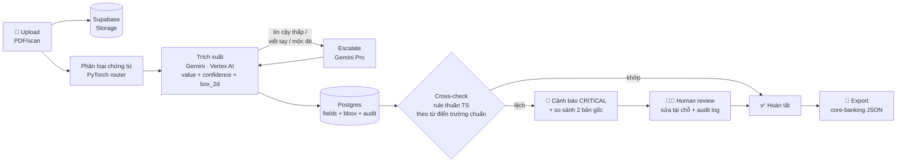

# DocFlow

**Hồ sơ tín dụng: từ scan đến core-banking trong vài phút — trích xuất có truy vết nguồn, không bịa số liệu.**

Bài dự thi Vietnam AI Innovation Challenge 2026 · Đề SHB #195 — Intelligent Document Processing · Track Tài chính/Ngân hàng · Team **OCanbubu**

> 🔗 **Demo:** https://docflow.huynhchitai.com
> Mã truy cập: xem trong hồ sơ Checkpoint 2 trên hub BTC (mục credentials).
>
> *(English: AI document processing for Vietnamese bank credit dossiers — classify, extract with source-traceable bounding boxes, cross-check across documents, human review with audit trail, export to core banking. Built in 48h, 100% AI-generated code.)*

---

## DocFlow làm được gì

Cán bộ tín dụng nhận một bộ hồ sơ vay gồm nhiều chứng từ scan (đơn vay, báo cáo tài chính, hợp đồng thế chấp, điện SWIFT/TT) và phải gõ lại hàng chục trường vào hệ thống. DocFlow thay việc gõ tay đó bằng một luồng duy nhất:

1. **Thả cả bộ hồ sơ vào** — nhiều file PDF/ảnh một lúc, xử lý **song song**, scan điện thoại mờ/nghiêng vẫn đọc được
2. **PyTorch router phân loại trước** (ResNet18 fine-tune, 120–290ms, đúng 4/4 loại @ 99–100%) → định tuyến schema và gợi ý cho Gemini trích xuất (p50 26 giây/chứng từ, đồng hồ ⏱ đo thật từng file)
3. **Mọi con số đều truy vết được** — click một trường, bản scan gốc mở đúng vị trí, khoanh cam từng dòng
4. **Tự đối chiếu chéo giữa các chứng từ** — CCCD/số tiền/kỳ hạn lệch nhau là báo đỏ CRITICAL; click ô lệch mở **hai bản gốc cạnh nhau** để đối chất; tên khách khai báo lúc tạo bộ cũng được đối chiếu với tên trên giấy
5. **Người duyệt sửa tại chỗ** — double-click giá trị để sửa, mọi thay đổi ghi vào audit log; trường tin cậy thấp tự đánh vàng/đỏ
6. **Bấm Export core-banking** — payload nói đúng ngôn ngữ hệ thống SHB: khối **CIF** (Customer Information File), cash-flow, metadata tích hợp nhắm core **Intellect (SOA/ESB)** qua adapter — không đụng core
7. **Nghiệp vụ tự cấu hình trường mới** ngay trên UI (⚙️ Trường dữ liệu) — thêm "Mã số thuế" trong 10 giây, có hiệu lực tức thì với prompt AI, không cần deploy

Nguyên tắc thiết kế: **không bịa**. Trường nào AI không đọc được thì bỏ trống + cảnh báo, không đoán. Trường nào tin cậy thấp thì đánh vàng/đỏ chờ người duyệt.

## Số liệu đo thật (không phải ước lượng)

Đo trên production, có ground truth, script công khai tại [`metrics/`](metrics/):

| Chỉ số                                              | Kết quả                                                                                                           |
| ----------------------------------------------------- | ------------------------------------------------------------------------------------------------------------------- |
| Field trích đúng (12 lượt × 4 loại chứng từ) | **95%** (84.4% nếu tính cả lượt lỗi hạ tầng — công bố cả hai)                                     |
| PyTorch router phân loại                            | **4/4 loại đúng, confidence 99–100%, 120–290ms/lượt** (val acc 94.9% trên dataset 720 ảnh augmented) |
| Thời gian trích xuất / chứng từ                  | **p50 26s** — nhiều file chạy song song nên cả bộ ≈ file chậm nhất                                   |
| Ảnh chụp điện thoại nghiêng/mờ/nhiễu          | phân loại 3/3 đúng,**vẫn bắt được CCCD lệch giữa hai bản scan xấu**                              |
| Chi phí AI / bộ hồ sơ 4 chứng từ                | **< 500 đồng**                                                                                              |

## Pipeline xử lý

Triết lý phân vai: **AI đọc — code đối chiếu — người quyết định.**



## Quy ước trường chuẩn (canonical fields)

Để đối chiếu chéo được giữa các loại chứng từ, **cùng một thông tin phải mang cùng một key** — số CCCD luôn là `national_id` dù nó nằm trên đơn vay, hợp đồng hay điện SWIFT. Từ điển này là **một nguồn sự thật duy nhất** tại [`shared/fields.ts`](shared/fields.ts): prompt Gemini, cross-check engine và UI cùng import từ đây — thêm một trường mới chỉ sửa một chỗ.

| Key chuẩn                                                             | Nghĩa              | Chuẩn hóa khi so sánh                 | Đối chiếu chéo           |
| ---------------------------------------------------------------------- | ------------------- | ---------------------------------------- | ---------------------------- |
| `customer_name`                                                      | Họ và tên        | UPPERCASE, bỏ dấu, gộp khoảng trắng | ✅                           |
| `national_id`                                                        | Số CCCD            | chỉ giữ chữ số                       | ✅                           |
| `date_of_birth`                                                      | Ngày sinh          | chỉ giữ chữ số                       | ✅                           |
| `loan_amount`                                                        | Số tiền vay       | chỉ giữ chữ số                       | ✅                           |
| `loan_term`                                                          | Kỳ hạn            | chỉ giữ chữ số                       | ✅                           |
| `interest_rate`                                                      | Lãi suất          | chỉ giữ chữ số                       | ✅                           |
| `address` / `phone` / `occupation` / `income` / `collateral` | Thông tin bổ trợ | lowercase / chữ số                     | — (chỉ tổng hợp profile) |

Model lỡ đặt tên khác (`cccd`, `so_giay_to`, `borrower`…) vẫn được map về key chuẩn qua bảng alias trong cùng file. Vì sao đối chiếu bằng code thuần thay vì hỏi AI: trọng tài phải deterministic và giải thích được từng cảnh báo — bộ phận phát hiện sai lệch mà cũng dùng model thì tự nó có thể sai lệch.

## Hướng dẫn sử dụng (2 phút)

### Đăng nhập

Mở [demo](https://docflow.huynhchitai.com), nhập mã truy cập, bấm **Vào hệ thống**. Mã lưu trên máy bạn — lần sau vào thẳng.

### Tạo bộ hồ sơ và nạp chứng từ

1. Gõ tên (vd: *Hồ sơ vay · Nguyễn Văn An*) rồi bấm **+ Tạo bộ hồ sơ**. Bỏ trống tên cũng được — hệ thống tự đặt theo ngày giờ.
2. Thả file vào vùng **"Thả thêm chứng từ vào đây"** — chọn được nhiều file. Dùng thử bộ mẫu trong [`demo-data/`](demo-data/) (dữ liệu hư cấu, có cài sẵn một lỗi lệch CCCD để xem cảnh báo).
3. Chờ dòng *"Đang trích xuất — Gemini đang đọc từng trang…"* chạy xong (mỗi chứng từ hiển thị ⏱ thời gian xử lý thật).

### Đọc kết quả

- **Thẻ "👤 Thông tin chung khách hàng"** trên cùng: hồ sơ khách tổng hợp từ mọi chứng từ. `✓×2` nghĩa là giá trị khớp trên 2 chứng từ; ô viền đỏ **⚠️ LỆCH** nghĩa là các chứng từ mâu thuẫn nhau.
- **Banner đỏ CRITICAL**: cảnh báo đối chiếu chéo (vd: *Số CCCD không khớp giữa hợp đồng và đơn vay*).
- **Bảng trường theo từng chứng từ**: giá trị + % tin cậy (xanh ≥90, vàng ≥70, đỏ <70) + trang nguồn.

### Soi nguồn — tính năng đáng thử nhất

Click bất kỳ trường nào (trong thẻ khách hàng hoặc bảng). Bản scan gốc mở ở cột phải, **khoanh cam đúng vị trí con số đó**, phần còn lại mờ đi. Giá trị nằm vắt nhiều dòng thì khoanh từng dòng.

### Khi hai chứng từ cãi nhau

Ô nào trong thẻ khách hàng viền đỏ **⚠️ LỆCH** — click vào là hai bản scan gốc mở **cạnh nhau**, mỗi bên khoanh cam đúng chỗ giá trị mâu thuẫn. Đây là màn đối chất trực quan cho cán bộ kiểm soát rủi ro.

### Tự thêm trường dữ liệu (không cần dev)

Bấm **⚙️ Trường dữ liệu** → điền nhãn (key tự sinh), chọn kiểu chuẩn hóa, tick "Đối chiếu chéo"/"Lên thẻ khách" → **+ Thêm**. Trường mới có hiệu lực ngay với chứng từ upload sau đó — prompt AI tự cập nhật. Trường built-in bị khóa để bảo vệ quy ước chung.

### Duyệt và xuất

- Sửa giá trị sai: **double-click** vào giá trị → gõ lại → Enter. Trường đã sửa hiện ✏️ và được ưu tiên khi tổng hợp. Mọi lần sửa ghi vào audit log (ai, lúc nào, giá trị cũ → mới).
- Bấm **🏦 Export core-banking** để nhận payload JSON (`shb.core-banking.loan-intake.v1`) gồm thông tin khách hàng, khoản vay, danh mục chứng từ và trạng thái review.

## Kiến trúc

```
React SPA ── Cloudflare Worker (Hono) ── Cloud Run proxy (ADC, không key file) ── Vertex AI Gemini
                   │                            │
                   ├── Supabase Postgres        └── PyTorch classifier (router)
                   └── Supabase Storage (scan gốc)
```

Chi tiết đầy đủ (sơ đồ mermaid, pipeline, data model, lý do chọn từng mảnh): [`.claude/ARCHITECTURE.md`](.claude/ARCHITECTURE.md)

Điểm kiến trúc đáng chú ý:

- **PyTorch là ROUTER, không phải đồ trang trí**: ResNet18 fine-tune tại sự kiện (`training/`), TorchScript serve trên Cloud Run, chạy TRƯỚC Gemini để định tuyến schema + gợi ý loại chứng từ vào prompt — kết quả lưu DB, hiển thị chip 🔥 trên từng chứng từ
- **Vertex AI qua Cloud Run proxy chạy bằng service account ADC** — không tồn tại credential file nào trong hệ thống (org policy chặn SA key, và đó là điều tốt)
- **Xử lý file song song ở Worker** — upload n chứng từ tốn thời gian của chứng từ chậm nhất, không phải tổng
- **Bounding box `box_2d` chuẩn hóa 0–1000** trả thẳng từ Gemini trong structured output — giá trị nhiều dòng trả chùm box mỗi-dòng-một-khung; nguồn gốc mọi trường lưu trong Postgres cùng giá trị
- **Cross-check engine** chạy rule thuần TypeScript theo [từ điển trường chuẩn](shared/fields.ts) — "AI đọc, code đối chiếu, người quyết định"
- **Export nói ngôn ngữ core banking**: khối CIF + integration metadata nhắm Intellect Universal Banking (SOA/ESB) của SHB — adapter đứng trước core theo đúng nguyên tắc tích hợp hệ thống cũ
- API khóa bằng access code từ tầng Worker; RLS bật trên mọi bảng; retry 3 lần có backoff khi model flake

## Chạy local

```bash
pnpm install
cp .env.example .dev.vars   # điền SUPABASE_URL, SUPABASE_SECRET_KEY
pnpm dev                     # Vite + Worker (wrangler) cùng lúc
pnpm build && npx wrangler deploy   # deploy Cloudflare
```

Cần Node 22+. Schema DB: chạy lần lượt các file trong [`supabase/migrations/`](supabase/migrations/) bằng Supabase SQL Editor.

## Tuân thủ 100% AI-native

Toàn bộ code sinh bởi AI trong cửa sổ 48h của hackathon. Nhật ký cộng tác AI đầy đủ theo từng phiên: [`AI-LOG.md`](AI-LOG.md) (kèm session files Claude Code nộp trong final submission).

## Team OCanbubu

Vietnam AI Innovation Challenge 2026 · Đà Nẵng · 17–19/07/2026
