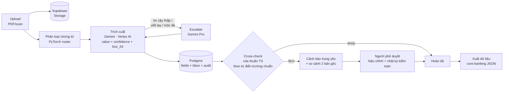

# DocFlow

**Hồ sơ tín dụng: từ scan đến core-banking trong vài phút — trích xuất có truy vết nguồn, mọi số liệu đều có nguồn kiểm chứng.**

Bài dự thi Vietnam AI Innovation Challenge 2026 · Đề SHB #195 — Intelligent Document Processing · Track Tài chính/Ngân hàng · Team **OCanbubu**

> **Demo:** https://docflow.huynhchitai.com
> Mã truy cập: xem trong hồ sơ Checkpoint 2 trên hub BTC (mục credentials).
>
> *(English: AI document processing for Vietnamese bank credit dossiers — classify, extract with source-traceable bounding boxes, cross-check across documents, human review with audit trail, export to core banking. Built in 48h, 100% AI-generated code.)*

---

## DocFlow làm được gì

Cán bộ tín dụng nhận một bộ hồ sơ vay gồm nhiều chứng từ scan (đơn vay, báo cáo tài chính, hợp đồng thế chấp, điện SWIFT/TT) và phải gõ lại hàng chục trường vào hệ thống. DocFlow thay việc gõ tay đó bằng một luồng duy nhất:

1. **Thả cả bộ hồ sơ vào** — nhiều file PDF/ảnh một lúc, xử lý **song song**, scan điện thoại mờ/nghiêng vẫn đọc được
2. **PyTorch router phân loại trước** (ResNet18 fine-tune, 120–290ms, đúng 4/4 loại @ 99–100%) → định tuyến schema và gợi ý cho Gemini trích xuất (p50 26 giây/chứng từ, thời gian đo thực tế từng tệp)
3. **Mọi con số đều truy vết được** — click một trường, bản scan gốc mở đúng vị trí, khoanh cam từng dòng
4. **Tự đối chiếu chéo giữa các chứng từ** — CCCD/số tiền/kỳ hạn lệch nhau là báo đỏ CRITICAL; click ô lệch mở **hai bản gốc cạnh nhau** để đối chất; tên khách khai báo lúc tạo bộ cũng được đối chiếu với tên trên giấy
5. **Người duyệt sửa tại chỗ** — double-click giá trị để sửa, mọi thay đổi ghi vào audit log; trường tin cậy thấp tự đánh vàng/đỏ
6. **Xuất dữ liệu core banking** — payload nói đúng ngôn ngữ hệ thống SHB: khối **CIF** (Customer Information File), cash-flow, metadata tích hợp nhắm core **Intellect (SOA/ESB)** qua adapter — không đụng core
7. **Nghiệp vụ tự cấu hình trường mới** ngay trên UI (mục Trường dữ liệu) — thêm "Mã số thuế" trong 10 giây, có hiệu lực tức thì với prompt AI, không cần deploy

Nguyên tắc thiết kế: **không suy diễn**. Trường nào AI không đọc được thì bỏ trống + cảnh báo, không đoán. Trường nào tin cậy thấp thì đánh vàng/đỏ chờ người duyệt.

## Số liệu đo thật (không phải ước lượng)

Đo trên production, có ground truth, script công khai tại [`metrics/`](metrics/):

| Chỉ số                                              | Kết quả                                                                                                           |
| ----------------------------------------------------- | ------------------------------------------------------------------------------------------------------------------- |
| Field trích đúng (12 lượt × 4 loại chứng từ) | **95%** (84.4% nếu tính cả lượt lỗi hạ tầng — công bố cả hai)                                     |
| PyTorch router phân loại                            | **4/4 loại đúng, confidence 99–100%, 120–290ms/lượt** (val acc 94.9% trên dataset 720 ảnh augmented) |
| Thời gian trích xuất / chứng từ                  | **p50 26s** — nhiều file chạy song song nên cả bộ ≈ file chậm nhất                                   |
| Ảnh chụp điện thoại nghiêng/mờ/nhiễu          | phân loại 3/3 đúng,**vẫn bắt được CCCD lệch giữa hai bản scan xấu**                              |
| Chi phí AI / bộ hồ sơ 4 chứng từ                | **< 500 đồng**                                                                                              |

## Đối chiếu đề bài SHB #195

Từng deliverable trong đề và nơi nó tồn tại trong sản phẩm:

| Yêu cầu của đề | DocFlow đáp ứng |
| --- | --- |
| Xử lý tự động hồ sơ vay tải lên (PDF/scan) | Upload nhiều file một lúc, xử lý song song, p50 26s/chứng từ |
| Phân loại chứng từ | PyTorch ResNet18 router: đơn vay / báo cáo tài chính / hợp đồng tín dụng / SWIFT — chạy trước, định tuyến schema cho bước trích xuất |
| Trích xuất thông tin khách hàng | Thẻ "Thông tin chung khách hàng" tổng hợp đa chứng từ, xuất thành khối CIF |
| Trích xuất tài sản bảo đảm | Trường `collateral` trong [từ điển trường chuẩn](shared/fields.ts) |
| Trích xuất dữ liệu dòng tiền | `revenue` · `net_profit` · `repayment_source` · `monthly_repayment` + khối `cash_flow` trong payload export |
| Điện SWIFT/TT | Đọc MT103 (reference, 32A, ordering/beneficiary…) — bộ mẫu [`demo-data/`](demo-data/) |
| Tự động điền biểu mẫu | Payload core-banking điền sẵn toàn bộ CIF + khoản vay — cán bộ không gõ lại trường nào, chỉ duyệt |
| Hỗ trợ quyết định phê duyệt tín dụng | Đối chiếu chéo giữa chứng từ, cảnh báo trọng yếu, hàng chờ hiệu chỉnh có nhật ký kiểm toán |
| Dashboard theo dõi trạng thái xử lý | Bảng KPI + trạng thái từng bộ hồ sơ và từng chứng từ, cập nhật ngay khi xử lý xong |
| API tích hợp core banking | REST `/api/dossiers/:id/export` — schema `shb.core-banking.loan-intake.v1`, khóa bằng access code |
| Giảm 70–80% thời gian nhập liệu | Số đo thật thay cho lời hứa: 95% field đúng, p50 26s, < 500đ/bộ — [`metrics/`](metrics/) |

Đề gợi ý cả RAG: DocFlow chủ đích chọn **grounding bằng bounding box** thay vì RAG — bài toán cốt lõi là trích xuất có kiểm chứng từng con số, không phải hỏi đáp tài liệu. Q&A trên bộ hồ sơ nằm trong lộ trình mở rộng ([`docs/ROADMAP.md`](docs/ROADMAP.md)).

## Pipeline xử lý

Triết lý phân vai: **AI đọc — code đối chiếu — người quyết định.**



## Quy ước trường chuẩn (canonical fields)

Để đối chiếu chéo được giữa các loại chứng từ, **cùng một thông tin phải mang cùng một key** — số CCCD luôn là `national_id` dù nó nằm trên đơn vay, hợp đồng hay điện SWIFT. Từ điển này là **một nguồn sự thật duy nhất** tại [`shared/fields.ts`](shared/fields.ts): prompt Gemini, cross-check engine và UI cùng import từ đây — thêm một trường mới chỉ sửa một chỗ.

| Key chuẩn                                                             | Nghĩa              | Chuẩn hóa khi so sánh                 | Đối chiếu chéo           |
| ---------------------------------------------------------------------- | ------------------- | ---------------------------------------- | ---------------------------- |
| `customer_name`                                                      | Họ và tên        | UPPERCASE, bỏ dấu, gộp khoảng trắng | ✓                           |
| `national_id`                                                        | Số CCCD            | chỉ giữ chữ số                       | ✓                           |
| `date_of_birth`                                                      | Ngày sinh          | chỉ giữ chữ số                       | ✓                           |
| `loan_amount`                                                        | Số tiền vay       | chỉ giữ chữ số                       | ✓                           |
| `loan_term`                                                          | Kỳ hạn            | chỉ giữ chữ số                       | ✓                           |
| `interest_rate`                                                      | Lãi suất          | chỉ giữ chữ số                       | ✓                           |
| `address` / `phone` / `occupation` / `income` / `collateral` | Thông tin bổ trợ | lowercase / chữ số                     | — (chỉ tổng hợp profile) |

Model lỡ đặt tên khác (`cccd`, `so_giay_to`, `borrower`…) vẫn được map về key chuẩn qua bảng alias trong cùng file. Vì sao đối chiếu bằng code thuần thay vì hỏi AI: trọng tài phải deterministic và giải thích được từng cảnh báo — bộ phận phát hiện sai lệch mà cũng dùng model thì tự nó có thể sai lệch.

## Hướng dẫn sử dụng (2 phút)

### Đăng nhập

Mở [demo](https://docflow.huynhchitai.com), nhập mã truy cập, bấm **Vào hệ thống**. Mã lưu trên máy bạn — lần sau vào thẳng.

### Tạo bộ hồ sơ và nạp chứng từ

1. Gõ tên (vd: *Hồ sơ vay · Nguyễn Văn An*) rồi bấm **+ Tạo bộ hồ sơ**. Bỏ trống tên cũng được — hệ thống tự đặt theo ngày giờ.
2. Thả file vào vùng **"Thả thêm chứng từ vào đây"** — chọn được nhiều file. Dùng thử bộ mẫu trong [`demo-data/`](demo-data/) (dữ liệu hư cấu, có cài sẵn một lỗi lệch CCCD để xem cảnh báo).
3. Chờ dòng *"Đang trích xuất — Gemini đang đọc từng trang…"* chạy xong (mỗi chứng từ hiển thị thời gian xử lý thực tế).

### Đọc kết quả

- **Thẻ "Thông tin chung khách hàng"** trên cùng: hồ sơ khách tổng hợp từ mọi chứng từ. nhãn "2 nguồn" nghĩa là giá trị trùng khớp trên 2 chứng từ; ô viền đỏ **SAI LỆCH** nghĩa là các chứng từ mâu thuẫn nhau.
- **Cảnh báo trọng yếu** (banner đỏ): kết quả đối chiếu chéo (vd: *Số CCCD không khớp giữa hợp đồng và đơn vay*).
- **Bảng trường theo từng chứng từ**: giá trị + % tin cậy (xanh ≥90, vàng ≥70, đỏ <70) + trang nguồn.

### Truy vết nguồn dữ liệu

Chọn bất kỳ trường nào trong thẻ khách hàng hoặc bảng trường. Bản scan gốc mở ở cột phải và **đánh dấu đúng vị trí giá trị đó**, phần còn lại được làm mờ. Giá trị nằm vắt nhiều dòng thì khoanh từng dòng.

### Đối chiếu và phân xử khi chứng từ mâu thuẫn

Chọn ô **SAI LỆCH** trong thẻ khách hàng — hai bản scan gốc mở **cạnh nhau**, mỗi bên đánh dấu đúng vị trí giá trị mâu thuẫn. Dưới mỗi bản có nút **"Dùng giá trị này làm chuẩn"**: giá trị được chọn áp cho bản còn lại qua luồng hiệu chỉnh có ghi nhật ký, cảnh báo được tính lại ngay.

Trường hợp **cả hai bản đều sai** so với bản gốc: nhập giá trị đúng vào hàng **"Cả hai đều sai?"** ngay dưới hai bản scan — hoặc **nhấp đúp** một ô bất kỳ trong thẻ khách hàng để nhập tay giá trị chuẩn, áp cho toàn bộ chứng từ nguồn cùng lúc. Mọi đường sửa đều đi qua nhật ký kiểm toán.

### Tự thêm trường dữ liệu (không cần dev)

Chọn **Trường dữ liệu** → điền nhãn (key tự sinh), chọn kiểu chuẩn hóa, tick "Đối chiếu chéo"/"Lên thẻ khách" → **+ Thêm**. Trường mới có hiệu lực ngay với chứng từ upload sau đó — prompt AI tự cập nhật. Trường built-in bị khóa để bảo vệ quy ước chung.

### Hiệu chỉnh và chuyển core banking

- Hiệu chỉnh giá trị: **nhấp đúp** vào giá trị, nhập lại và xác nhận. Trường đã hiệu chỉnh được đánh dấu biểu tượng bút và ưu tiên khi tổng hợp. Mọi thay đổi ghi vào **nhật ký kiểm toán** (người sửa, thời điểm, giá trị cũ và mới).
- Chọn **Xuất dữ liệu core banking** để nhận payload JSON (`shb.core-banking.loan-intake.v1`) gồm thông tin khách hàng, khoản vay, danh mục chứng từ và trạng thái review.

## Kiến trúc

```
React SPA ── Cloudflare Worker (Hono) ── Cloud Run proxy (ADC, không key file) ── Vertex AI Gemini
                   │                            │
                   ├── Supabase Postgres        └── PyTorch classifier (router)
                   └── Supabase Storage (scan gốc)
```

Chi tiết đầy đủ (sơ đồ mermaid, pipeline, data model, lý do chọn từng mảnh): [`.claude/ARCHITECTURE.md`](.claude/ARCHITECTURE.md)

Điểm kiến trúc đáng chú ý:

- **PyTorch là ROUTER, không phải đồ trang trí**: ResNet18 fine-tune tại sự kiện (`training/`), TorchScript serve trên Cloud Run, chạy TRƯỚC Gemini để định tuyến schema + gợi ý loại chứng từ vào prompt — kết quả lưu DB, hiển thị chip PyTorch trên từng chứng từ
- **Vertex AI qua Cloud Run proxy chạy bằng service account ADC** — không tồn tại credential file nào trong hệ thống (org policy chặn SA key, và đó là điều tốt)
- **Xử lý file song song ở Worker** — upload n chứng từ tốn thời gian của chứng từ chậm nhất, không phải tổng
- **Bounding box `box_2d` chuẩn hóa 0–1000** trả thẳng từ Gemini trong structured output — giá trị nhiều dòng trả chùm box mỗi-dòng-một-khung; nguồn gốc mọi trường lưu trong Postgres cùng giá trị
- **Cross-check engine** chạy rule thuần TypeScript theo [từ điển trường chuẩn](shared/fields.ts) — "AI đọc, code đối chiếu, người quyết định"
- **Export nói ngôn ngữ core banking**: khối CIF + integration metadata nhắm Intellect Universal Banking (SOA/ESB) của SHB — adapter đứng trước core theo đúng nguyên tắc tích hợp hệ thống cũ
- API khóa bằng access code từ tầng Worker; RLS bật trên mọi bảng; retry 3 lần có backoff khi model flake
- **Lộ trình distillation**: mỗi trường được người phê duyệt là một nhãn ground truth kèm bbox — review queue chính là dây chuyền gán nhãn. Đủ dữ liệu vận hành thì các loại chứng từ layout ổn định chuyển dần sang extractor PyTorch chuyên biệt chạy on-prem (dữ liệu không rời ngân hàng, chi phí biên tiệm cận 0), Gemini rút về làm lưới an toàn cho ca khó

## An toàn AI, grounding & độ tin cậy

Thiết kế theo nguyên tắc: **AI không được phép nói mà không chỉ tay.**

- **Không suy diễn**: trường không đọc được thì để trống + cảnh báo, không đoán; cảnh báo thiếu chữ ký/con dấu do model tự phát hiện được ghi rõ trên từng chứng từ
- **Grounding bằng bounding box**: mọi giá trị trích xuất phải kèm `box_2d` trỏ về vị trí trên bản gốc, lưu trong Postgres cùng giá trị — người duyệt kiểm chứng bằng mắt trong một giây
- **Trọng tài deterministic**: đối chiếu chéo chạy rule thuần TypeScript theo từ điển trường chuẩn, không dùng model — bộ phận bắt sai lệch không được phép tự sai lệch; mọi cảnh báo giải thích được
- **Human-in-the-loop có dấu vết**: trường tin cậy thấp chờ người duyệt; mọi hiệu chỉnh (kể cả nhập tay khi mọi bản đều sai) ghi nhật ký kiểm toán ai-sửa-gì-khi-nào
- **Bảo mật**: access code chặn từ tầng Worker, RLS bật trên mọi bảng, file scan trong private bucket, **không tồn tại credential file nào** (Cloud Run chạy service account ADC), model flake retry 3 lần có backoff
- **Dữ liệu demo 100% hư cấu có watermark** — không PII thật trong toàn bộ hệ thống

## Mô hình kinh doanh & lộ trình pilot

**Đơn vị kinh tế**: chi phí AI < 500đ/bộ hồ sơ (đo thật, hai lớp cache) — mỗi 10.000 bộ/tháng tốn ~5 triệu đồng AI, đổi lấy hàng nghìn giờ công nhập liệu. Biên gộp phần mềm > 90%.

**Ba nguồn thu**: (1) phí xử lý theo bộ hồ sơ — SaaS theo lượt; (2) gói tích hợp core-banking một lần — adapter Intellect/ESB, mapping trường theo nghiệp vụ; (3) thuê bao vận hành theo chi nhánh/tháng — dashboard, audit, SLA.

**Lộ trình pilot với SHB**:

| Mốc | Nội dung | KPI |
| --- | --- | --- |
| 2 tuần | Sandbox trên hồ sơ ẩn danh SHB | đo accuracy trên dữ liệu thật ngân hàng |
| 3 tháng | Pilot một chi nhánh, luồng vay cá nhân | 70% trường tự động, đo giờ công tiết kiệm |
| 6 tháng | Distill sang extractor PyTorch on-prem (nhãn từ chính review queue), mở rộng SWIFT/TT + BCTC doanh nghiệp | chi phí biên tiệm cận 0, dữ liệu không rời ngân hàng |

**Thị trường**: bắt đầu từ SHB → nhân rộng khối ngân hàng thương mại Việt Nam; cùng một lõi IDP + từ điển trường cấu hình được dùng cho bảo hiểm, chứng khoán, công ty tài chính.

## Đối chiếu tiêu chí chấm điểm

| Tiêu chí BTC | Bằng chứng trong repo |
| --- | --- |
| Chất lượng triển khai kỹ thuật (20đ) | Live production + [số liệu đo thật](#số-liệu-đo-thật-không-phải-ước-lượng) có script tái lập ([`metrics/`](metrics/)), xử lý song song, cache 2 lớp |
| Kiến trúc AI-Native & Đổi mới (20đ) | AI là lõi pipeline: PyTorch router → Gemini extract → cross-check ([`.claude/ARCHITECTURE.md`](.claude/ARCHITECTURE.md)); flywheel distillation |
| Khả thi kinh doanh & Pilot (20đ) | [Mô hình kinh doanh & lộ trình pilot](#mô-hình-kinh-doanh--lộ-trình-pilot) ngay trên đây |
| UX AI-Native (15đ) | Truy vết bbox click-to-highlight, so sánh 2 bản gốc, nhập tay có kiểm soát, tiến độ thời gian thực, [hướng dẫn 2 phút](#hướng-dẫn-sử-dụng-2-phút) |
| An toàn AI & Grounding (15đ) | [Mục riêng phía trên](#an-toàn-ai-grounding--độ-tin-cậy) |
| Trình bày (10đ) | [`docs/PITCH.md`](docs/PITCH.md) + deck [`docs/DocFlow-pitch-DemoDay.pptx`](docs/DocFlow-pitch-DemoDay.pptx) + video demo có thuyết minh |

## Chạy local

```bash
pnpm install
cp .env.example .dev.vars   # điền SUPABASE_URL, SUPABASE_SECRET_KEY
pnpm dev                     # Vite + Worker (wrangler) cùng lúc
pnpm build && npx wrangler deploy   # deploy Cloudflare
```

Cần Node 22+. Schema DB: chạy lần lượt các file trong [`supabase/migrations/`](supabase/migrations/) bằng Supabase SQL Editor.

## Cấu trúc dự án

```
src/            React SPA (App, Guide, DocViewer, api client)
worker/         Cloudflare Worker — orchestrator, pipeline, cross-check, API
shared/         Từ điển trường chuẩn — một nguồn sự thật cho prompt + rule + UI
gcp-proxy/      Cloud Run: Vertex AI proxy (ADC) + PyTorch router (model.pt)
training/       Sinh dataset + fine-tune ResNet18 (dataset tái tạo bằng make_dataset.py)
supabase/       Migrations SQL (4 file, chạy theo thứ tự)
demo-data/      Bộ hồ sơ mẫu hư cấu + bản scan giả lập + generator
metrics/        Benchmark accuracy có ground truth + báo cáo
docs/           PITCH · ROADMAP · BACKLOG · MENTORS-SHB (tài liệu vận hành đội)
.claude/        ARCHITECTURE.md — sơ đồ mermaid, data model, kịch bản demo
```

## Tuân thủ 100% AI-native

Toàn bộ code sinh bởi AI trong cửa sổ 48h của hackathon. Nhật ký cộng tác AI đầy đủ theo từng phiên: [`AI-LOG.md`](AI-LOG.md) (kèm session files Claude Code nộp trong final submission).

## Team OCanbubu

Vietnam AI Innovation Challenge 2026 · Đà Nẵng · 17–19/07/2026

## Bản quyền

Mã nguồn công khai để phục vụ chấm thi — mọi quyền được bảo lưu bởi Team OCanbubu. Xem [LICENSE](LICENSE).
